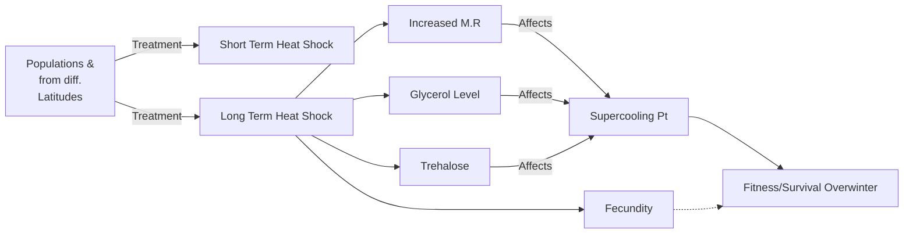

#Homework 2 
##Luke Daniels
January 26th, 2018

**Background**

The major cue regulating diapause is the photoperiod. The genetics underlying entry into diapause can be categorized into roughly four interconnected modules.  It is known that hormones exert some control over diapause strategies.  Photoperiod is sometimes a pore indicator of diapause strategies.  Temperature and diet also have stong effects on diapause propencity.  This study seeks to understand the effects of global warming on P. rapae. 

*This experiment is based on the work of Emily Mikucki.  I do not take credit for the experimental design.  I am currently assisting Emily in the Lockwood Lab*

**Three Primary Questions**
1.) How do temperature and photoperiod interact in determining diapause induction and exit? 

2.) How do diapausing *P. rapae* at different lattitudes differ in cold tolerance mechanisms?

3.) How have environmental factors and life history  shaped the evolution of diapause strategies?

**Brief Predictions:**
1.)   *P. rapae* face physiological consequences under winter warming conditions in the pupae stage that could compromise cold tolerance capacity, increase metabolic rate, and shorten developmental timing 

2.) Inviduals at higher latitudes with more intense diapause will have lower supercooling point and therefore have higher cold tolerance.

3.) Closely related species will have the same diapause strategy shared by their common ancetor.  Closely related species will exhibit different diapause strategies due to different exposure to environmental conditions. 

The following schematic represents the thought process in testing compromised cold tolerance capacity due to winter warming. 


Temperature shocks in the pupae stage may affect an organisms ability to survive the winter months. The previous schematic represents only part of the experiment.  However, understanding the magnitude at which temperature is affecting metabolic activity levels, gycerol levels and more is an important indicator of how climate change may start to affect diapause strategies. 


While many butterfly species have been genetically mapped, there is still no study that has created an inclusive phylogeny with mapped diapause strategies.  Using explanatory variables such as host plant, voltinism (ect.) will be helpful in uncovering the envornmental factors associated with the evolution of diapause strategies. 

Below is a more complicated schematic of the experiment as a whole. 


``` mermaid
graph TD
   
    
    O((Latitude))
    P((Voltinism))
    U((Geography))
    Y((Host Plant))
    J((Increased Metabolic Rate))
    L((Fecundity))
    
    R((P. Rapae Susceptibility to Climate Change))
    
      O ==> B
      P ==> B
      U ==> B
      Y ==> B
      D ==> R 
      B -.-> R
      A ==> J
      A ==> L 
      L ==>R
      
     
  	J ==> |<b>Rates of Biochemical Reactions| F((<b> Altered Energetic <br/> Reserves))
  	A((Increased Temperatures))
    B((Evolution & Life History <br/> Affecting Diapause Strategies))
    
    
    A ==> |<b>Decreased Glycerol| F((<b> Altered Energetic <br/> Reserves))
    
    A ==> |<b> Decreased Gylcerol| C((Depressed Supercooling <br/> Point))
    
    A==> |<b> Decreased Trehalose| C((Depressed Supercooling <br/> Point ))
    
     L -.->D((Decreased Fitness <br/> Susceptible to Cold Winter))
    C ==> |<b> Internal Freezing| D((Decreased Fitness <br/> Susceptible to Cold Winter))
   
    
    F ==> |<b> Unavailable Nutrients| D((Decreased Fitness <br/> Susceptible to Cold Winter))
    Cold Tolerance <br/> Mechanisms
    
    style O fill:#8B795E, stroke:#139 , stroke-width: 4px;
    style B fill:#B0E0E6, stroke: #333, stroke-width: 4px;
    style C fill:#B0E0E6, stroke: #333, stroke-width: 4px;
    style D fill:#B0E0E6, stroke: #333, stroke-width: 4px;
```

```mermaid
Graph TD 


```